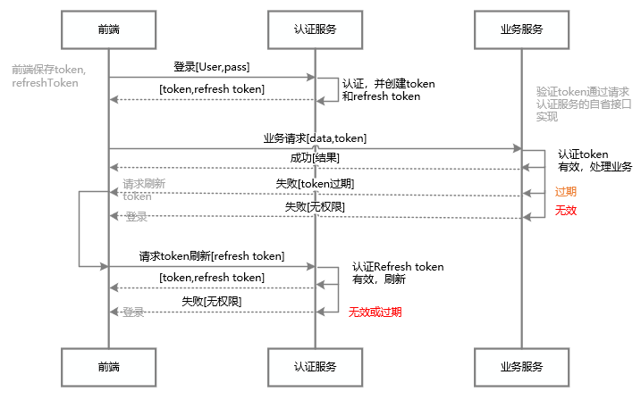

# jwt API Example 2.0

## 主要技术点：
+ JWT token 保存到 redis实现有状态，解决无状态JWT的不干净退出。 登出之后无法再使用refreshtoken和accesstoken
+ mariadb golang 基本操作
+ refresh token机制
+ bearer token 机制
+ 统一配置文件yaml
+ 实现拦截器
+ 模拟signup/signin/signout/refresh/welcome handler处理
## 流程

## 第三方库使用
+ github.com/dgrijalva/jwt-go v3.2.0+incompatible
+ github.com/go-redis/redis v6.15.9+incompatible
+ github.com/go-sql-driver/mysql v1.6.0
+ github.com/twinj/uuid v1.0.0
+ golang.org/x/crypto v0.0.0-20211215153901-e495a2d5b3d3
+ gopkg.in/yaml.v3 v3.0.0-20210107192922-496545a6307b
## bug
+ 未按照oauth2标准响应格式返回（包括成功和错误）
+ 缺少认证服务的自省接口（供业务服务调用以验证token有效性）
+ 只实现JWT claims 的签名，未实现alg中使用RSA公钥加密